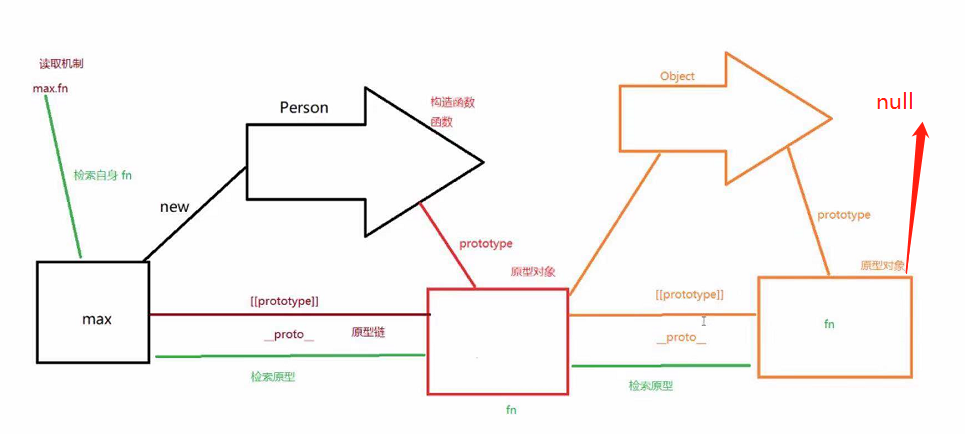

# 2.7.2扩展-js的面向对象

## js的对象和java对象的区别

1. 为什么js有对象却没有类的概念
2. 为什么js对象可以自由的添加属性

## 什么是对象？

### 自然语言解释对象

1. 对象是可以触摸，看得见的东西
2. 人可以理解的东西
3. 可以指导，思考或行动的东西 

### 编程语言解释对象

- 在java,c++中都是`类`的方式来描述的,js是通过原型的方式来描述对象的
- 在编程语言里面对象的特征
  1. 对象具有唯一的标识性,例如`var obj = {}; var obj1 = {}; obj === obj1 // fasle`,每一个对象里面都有独一无二的内存地址
  2. 对象是有状态的 
  3. 对象是具有行为的
- 怎么描述的状态和行为。在c++里面用成员变量来描述状态，成员函数来描述行为。在java中把状态描述属性，行为描述成方法。在js里面把状态描述成属性，行为描述成方法，但在js里面函数被称为特殊的对象，所以说在js里面没有方法这一说法，把状态和行为都成为属性

## js的对象具有高度的动态性

在运行时来添加对象的状态和行为。因为js不需要将我们的代码生成目标平台的代码，这一步操作并没有中间额外的代码生成，js是一门解释性的语言，所以js是解释执行的，即时编译的，造就了他的高度动态性

## js提高了属性的抽象能力
给对象里面的属性还增加了一组对象，这一组对象叫做属性的描述对象。
属性的描述对象分为两类
1. 数据属性（分别有4个属性）
  - `value` 表示当前这个对象属性的值。比如说`var obj = {name: "max"}`里面的obj.name的属性描述对象里的value指的就是"max"这个值
  - `writable` 表示能否修改属性的值,是一个boolean值,默认为true
  - `enumerable` 表示属性是否可枚举，也就是是否能通过`for in`遍历，是一个boolean,默认为true
  - `configrable` 表示是否可配置，即属性能否通过delete删除，能否修改属性的特征，或者能否把属性修改为访问属性，是一个boolean值，默认为true
2. 访问器属性
  - get:在读取属性时调用的函数，默认值为undefined     钩子函数
  - set:在写入属性时调用的函数，默认值为undefined     钩子函数
```js
  var obj = {count: 1};
  console.log(obj.count) // 这个的输出结果是1
  // 但做了以下的监听以后
  Object.defineProperty(obj, "count", { //设置访问器的钩子函数
    get: function(){
      // 获取的时候进行拦截
      // 当这里return一个数据的时候 那么现在再进行obj.count获取值的时候 获取到的是这个return后面跟着的数据
    },
    set: function(newValue){
      // 赋值的时候进行拦截
      // 当obj.count = 4的时候 newValue的值是4
    }
  })
  console.log(obj.count) // undefined 会去调用这个钩子函数里面的get方法
  obj.count = 4;
```
  - 也就是说在js里面当你赋值的时候，触发了这个对象的描述对象里面的访问器属性的set钩子函数
  - 当获取值的时候，触发了这个对象的描述对象里面的访问器属性的get钩子函数

## 当我们要访问一个对象的属性的时候，发生了什么事情（在es6之前没有类的概念，js怎么进行复用属性）
在js里面通过原型的方式来进行桥接的。在js里面任意对象都有一个私有属性__proto__ 指向原型对象。当我们读取一个对象的属性的时候，如果这个对象本身没有这个属性，那么就去访问对象的原型，如果对象的原型身上也没有这个属性，那么一直往上找(原型的原型身上)，直到找到null。
```js
function Person(){
  this.name = "max";
  this.fn = function(){}
}
var max = new Person();
```
这种方法是给实例身上扩展属性，当创建一个实例的时候还好，不会出现太大问题，但是当我们创建多个实例的时候，那么就要创建在内存中创建多个name和fn的属性并且指向当前的那个实例，为了避免这种情况，我们应该在原型上添加属性。
```js
  function Person(){

  }
  Person.prototype = {   //这个虽然叫做原型对象 但也是通过Object字面量创建出来的
    name: "max",
    fn: function(){}
  }
  var max = new Person();
  max.__proto__.__proto__ === Object.prototype // true
  Person.prototype.__proto__ === Object.prototype // true
```


### 变异方法 可以改变数组的值 push pop unshift splice sort...
当你执行这些方法的时候，进行拦截，进行一些数据收集，在进行这些操作。怎么进行拦截呢？通过代理原型(也叫`借壳`)的方式进行拦截。比如说：
```js
var methods = [
  "push",
  "pop",
  "shift",
  "unshift",
  "splice",
  "sort",
  "reverse"
]
var arr = [];
var proxyProto = Object.create(Array.prototype); //创建一个对象 并且将这个对象的原型指向arr的原型
// 让这个proxyProto当做一个中间层 进行拦截 他是这样做的，当你调用push方法的时候，他会先去proxyProto里面去找到这个方法，然后执行这个方法，并且在这个方法里面包含了Array.prototype上的push方法，通过上下文指定this让他执行
methods.forEach(function(method){
  proxyProto[method] = function(){
    // 这里的this指的是arr这个实例  因为arr.__ptoto__指向的是proxyProto，当实例调用方法的时候，谁调用，this就指向谁
    // arguments是我们通过方法传进来的`1`
    Array.prototype[method].apply(this, arguments);
  }
})
arr.push(1);
```